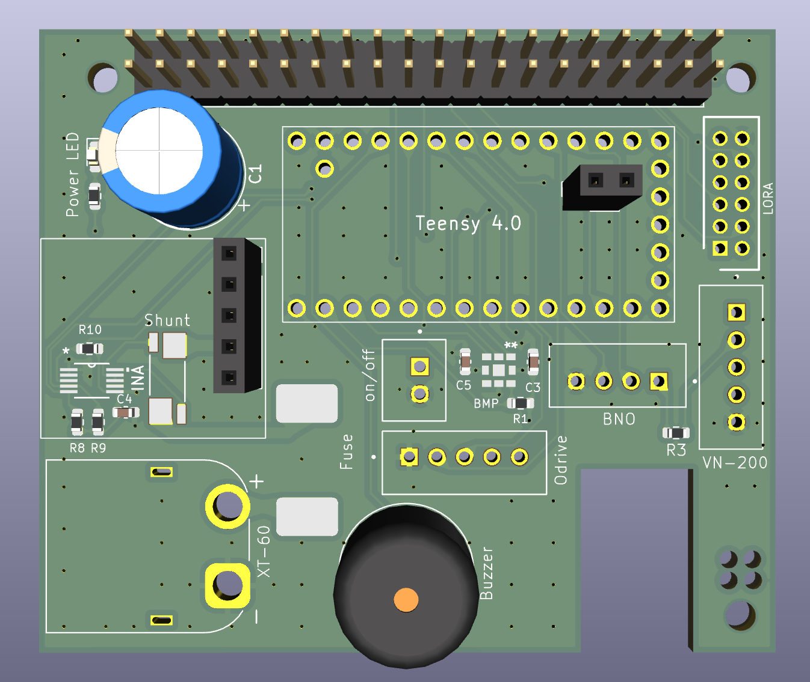
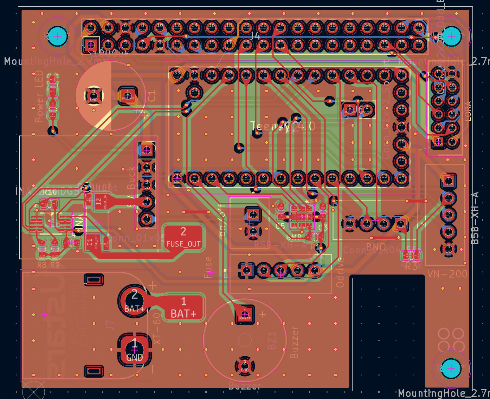
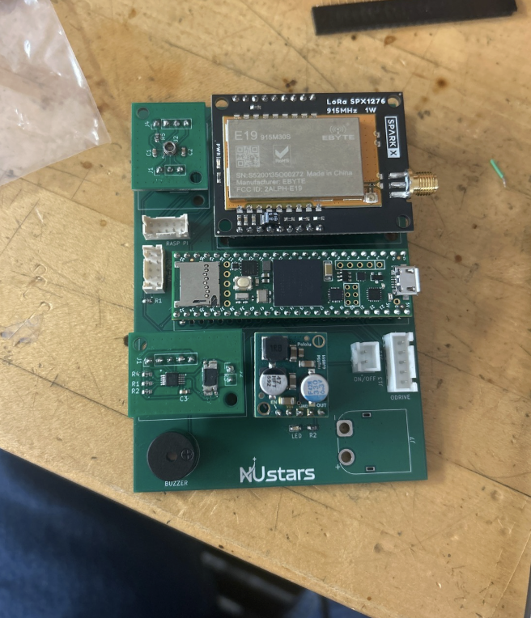

# NUSTARS
Payload PCB for Northwestern University's 2025-2026 IREC rocket

Objective:
Integrate electronics to gather and transfer flight data in a compact payload.

Steps Taken:
- Designed a 4-layer Printed Circuit Board (PCB) in KiCad integrating sensors and a microcontroller into a compact payload, ensuring signal integrity through optimized placement, grounding, and trace routing.
- Created a custom breakout board for the INA226 current/voltage sensor, implementing I²C communication and shunt-based current sensing to improve battery monitoring reliability and prevent power-related system failures.
- Verify and debug PCB functionality to ensure success during launches.
- Teach other team members PCB design and soldering skills to improve team efficiency.

Outcome:
Compact payload with reliable electronics for data acquisition during and after launch.

  
   
  <em>PCB Schematic</em>

  
   
  <em>PCB Routing</em>

  
   
  <em>PCB Rendering</em>

Final PCB was made to be a hat for the Raspberry Pi to be as compact as possible
Raspberry Pi handled video collection and Teensy 4.1 on the PCB collected data from altimeter and monitored battery life

  
   
  <em>Initial PCB made to have each system work modularly for ease of debugging</em>

